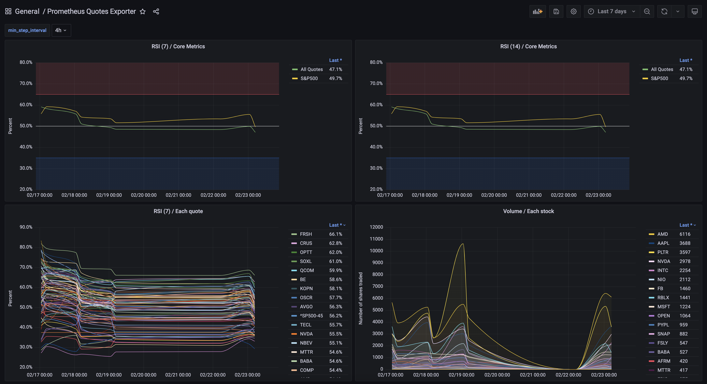

# my-grafana-dashboards

Grafana dashboards in my labo.

## Command

| Command       | Description                              |
| ------------- | ---------------------------------------- |
| `make import` | Import dashboard from my grafana-server. |

## Prerequisite

- Download and install [gdg](https://github.com/netsage-project/gdg).

- Put `config/gdg.yml`.

  ```bash
  cp conf/gdg.yml.sample conf/gdg.yml
  ```

- Set `contexts.main.token` in `config/gdg.yml`.

  ```bash
  vi conf/gdg.yml
  ```

- Done.

## Prometheus Blackbox Exporter

Monitoring my servers.


## Prometheus Quotes Exporter

Monitoring ETF and stock quotes.


